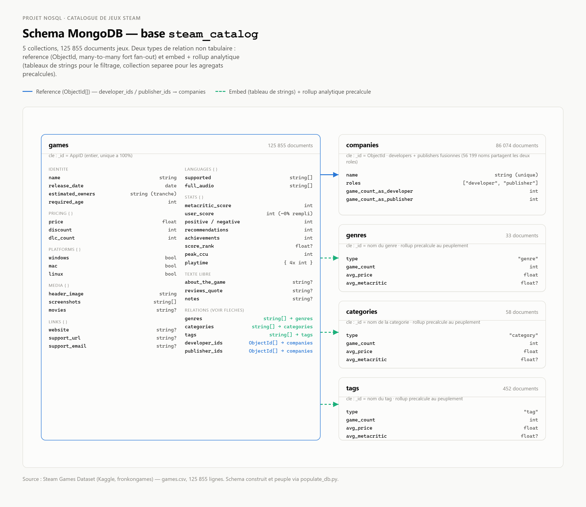
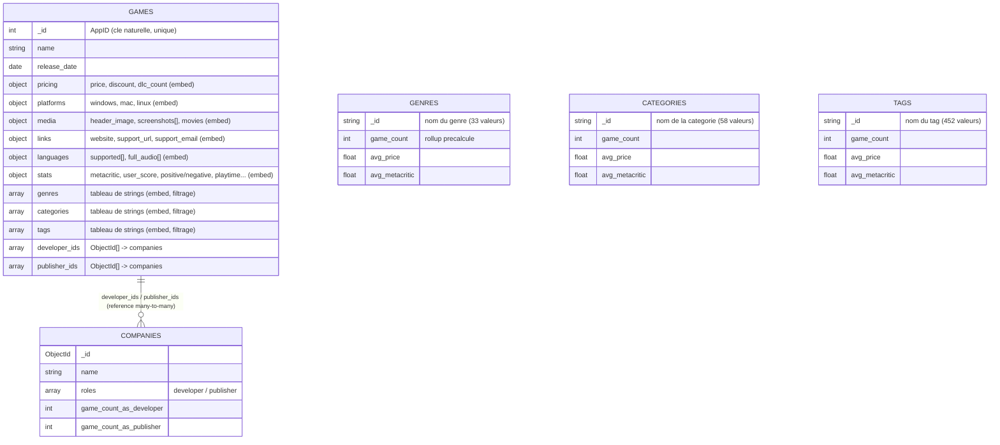

# Projet NoSQL — Catalogue de produits : jeux vidéo Steam

Groupe : 2-3 étudiants
Sujet : Catalogue de produits (base MongoDB), dataset réel Kaggle — [Steam Games Dataset](https://www.kaggle.com/datasets/fronkongames/steam-games-dataset) (`games.csv`)

---

## 1. Description du projet

**But / objectif.** Modéliser en NoSQL (MongoDB) le catalogue complet des jeux vendus sur la plateforme Steam (125 855 jeux réels), afin de répondre à des besoins métier d'analyse de catalogue (tendances de genres, performance des studios, stratégie de prix, support multi-plateforme, etc.) — le type de questions que se poseraient une équipe produit/data d'un store de jeux vidéo.

**Pourquoi NoSQL plutôt qu'un SGBD relationnel classique**, en s'appuyant sur la structure réelle observée dans le dataset (voir §3 pour les chiffres) :

- **Attributs multi-valués de cardinalité variable.** Chaque jeu a un nombre variable de genres (0 à plusieurs parmi 33), catégories (parmi 58), tags (parmi 452), développeurs et éditeurs. En SQL, cela impose 5 tables de jonction (`game_genres`, `game_categories`, `game_tags`, `game_developers`, `game_publishers`) rien que pour ces attributs. En MongoDB, ce sont de simples tableaux embarqués.
- **Forte sparsité des attributs.** `Score rank` est absent sur 99.97% des jeux, `Metacritic url` sur 96.6%, `Website` sur 59.9%. En SQL, ce sont des colonnes nullable sur des tables entières ; en MongoDB, le champ est simplement omis du document.
- **Pattern d'accès dominant = fiche produit complète.** Comme une page produit e-commerce, l'accès typique est "tout savoir sur un jeu en une lecture". En document, un seul `findOne` suffit ; en relationnel, il faudrait joindre jusqu'à 6 tables.
- **Texte libre volumineux et hétérogène** (`About the game` jusqu'à 89 665 caractères) : naturel en document, sans typage BLOB/TEXT spécifique.
- **Catalogue en lecture quasi exclusive** (peu de mises à jour après import) : la dénormalisation (tableaux de genres/tags embarqués) est rentable ici, contrairement à un système transactionnel.

---

## 2. Schéma MongoDB (ERD / relations non tabulaires)

5 collections : `games` (centrale), `companies` (référencée), `genres`, `categories`, `tags` (rollups analytiques).

**Diagramme ERD (image) :**



*(Version interactive : voir `erd_diagram.png` dans le dossier du projet. Version texte équivalente ci-dessous, format Mermaid, pour les outils qui le supportent.)*



**Choix embedding vs référencement, justifiés par les cardinalités réelles :**

| Relation | Choix | Justification (donnée réelle) |
|---|---|---|
| jeu ↔ platforms/media/stats/languages | **embed** (objet imbriqué) | 1:1 avec le jeu, toujours lu ensemble, aucun gain à séparer |
| jeu ↔ genres/categories/tags | **embed** (tableau de strings) + collection rollup séparée | faible cardinalité (33/58) à moyenne (452) ; tableau embarqué permet le filtrage direct (index multikey) ; la collection séparée stocke des agrégats précalculés (évite un `$unwind`+`$group` coûteux sur 125 855 documents à chaque requête de reporting) |
| jeu ↔ companies (dev/publisher) | **référence** (ObjectId) | forte cardinalité (77 574 devs, 64 583 publishers), fort fan-out (ex. certains publishers liés à 500+ jeux) → dupliquer leurs métadonnées dans chaque jeu serait l'anti-pattern classique ; 56 199 noms sont à la fois dev ET publisher → fusion en une seule collection `companies` avec un champ `roles` |

### Exemples de documents réels (extraits de `steam_catalog`)

**`games`** — document réel (`_id: 717640`, tableau `screenshots` tronqué pour la lisibilité) :

```json
{
  "_id": 717640,
  "name": "Reigns: Her Majesty",
  "release_date": "2017-12-06 00:00:00",
  "estimated_owners": "100000 - 200000",
  "required_age": 0,
  "pricing": { "price": 0.98, "discount": 0, "dlc_count": 2 },
  "platforms": { "windows": true, "mac": true, "linux": true },
  "media": {
    "header_image": "https://shared.akamai.steamstatic.com/store_item_assets/steam/apps/717640/header.jpg?t=1728690400",
    "screenshots": ["https://.../ss_e74c479b....jpg", "https://.../ss_3093c2db....jpg", "... (14 captures au total)"],
    "movies": null
  },
  "links": {
    "website": "http://www.reignsgame.com",
    "support_url": "http://www.reignsgame.com",
    "support_email": null
  },
  "languages": {
    "supported": ["English", "French", "Italian", "German", "Spanish - Spain", "Japanese", "Portuguese - Brazil", "Russian", "Simplified Chinese", "Traditional Chinese", "Korean"],
    "full_audio": []
  },
  "stats": {
    "metacritic_score": 81,
    "metacritic_url": "https://www.metacritic.com/game/pc/reigns-her-majesty?ftag=MCD-06-10aaa1f",
    "user_score": 0,
    "positive": 1049,
    "negative": 211,
    "recommendations": 1112,
    "achievements": 13,
    "score_rank": null,
    "peak_ccu": 5,
    "playtime": { "avg_forever": 214, "avg_2weeks": 0, "median_forever": 91, "median_2weeks": 0 }
  },
  "about_the_game": "Reigns: Her Majesty is the revolutionary follow-up to the smash swipe 'em up hit Reigns. A cultural renaissance has bestowed the world with a new era of knowledge and enlightenment...",
  "reviews_quote": null,
  "notes": null,
  "genres": ["Casual", "Indie", "Simulation"],
  "categories": ["Single-player", "Steam Achievements", "Partial Controller Support", "Family Sharing"],
  "tags": ["Indie", "Life Sim", "Female Protagonist", "Choices Matter", "Casual", "Card Game", "Simulation", "Strategy", "Medieval", "Choose Your Own Adventure", "Dark Humor", "Funny", "Dark Comedy", "Comedy", "Adventure", "Singleplayer"],
  "developer_ids": ["6a480d96ad48c7754c5ae0e1", "6a480d96ad48c7754c5b2ac6"],
  "publisher_ids": ["6a480d96ad48c7754c5a6c32"]
}
```

**`companies`** — document réel (studio auto-édité) :
```json
{
  "_id": "6a480d96ad48c7754c5a2630",
  "name": "0 Deer Soft",
  "roles": ["developer", "publisher"],
  "game_count_as_developer": 6,
  "game_count_as_publisher": 6
}
```

**`genres`** — document réel (`_id: "RPG"`) :
```json
{ "_id": "RPG", "type": "genre", "game_count": 21577, "avg_price": 6.92, "avg_metacritic": 74.86 }
```

**`categories`** — document réel (`_id: "Steam Achievements"`) :
```json
{ "_id": "Steam Achievements", "type": "category", "game_count": 57315, "avg_price": 5.41, "avg_metacritic": 74.22 }
```

**`tags`** — document réel (`_id: "Souls-like"`) :
```json
{ "_id": "Souls-like", "type": "tag", "game_count": 1284, "avg_price": 6.21, "avg_metacritic": 77.39 }
```

---

## 3. Inspection réelle du dataset (chiffres vérifiés)

Script : `inspect_games.py`, `inspect_cardinalities.py`.

- **125 855 lignes**, **40 colonnes** (voir bug de header ci-dessous), `AppID` unique à 100%.
- **Bug de header découvert et corrigé** : le CSV source a un header de 39 noms de colonnes mais 40 champs par ligne — la colonne `DiscountDLC count` est la fusion accidentelle de deux en-têtes (`Discount` + `DLC count`, virgule manquante). Sans correction, toutes les colonnes suivantes (dates, owners, langues...) auraient été décalées et fausses. Corrigé en fournissant explicitement la liste de 40 noms de colonnes.
- Valeurs manquantes notables : `Score rank` 99.97%, `Metacritic url` 96.6%, `Reviews` 90.3%, `Website` 59.9%, `Tags` 33.8%.
- Cardinalités : Genres 33, Categories 58, Tags 452, Developers 77 574, Publishers 64 583 (56 199 communs aux deux rôles).
- **Limitation de données identifiée** : `Developers`/`Publishers` sont des chaînes séparées par virgules, mais ~1.1% des lignes contiennent une raison sociale avec virgule interne (ex. `"Accolade, Inc."`, `"TAITO CORP.,M2 Co., Ltd."`). Un split naïf sur `,` cassait ces raisons sociales et faisait apparaître `"Inc."`, `"LLC"`, `"Ltd."` comme de faux développeurs dans les premiers résultats de requêtes. **Corrigé** avec une regex qui ne coupe pas une virgule suivie d'un suffixe juridique courant (`Inc.`, `LLC`, `Ltd.`, `Co.`, `Corp.`, etc.), insensible à la casse.
- **Champ `User score` quasi inutilisé par Steam** : renseigné sur seulement 40 jeux / 125 855 (0.03%) — vérifié en base avant de bâtir une requête dessus (voir Q8 plus bas, requête adaptée en conséquence).

---

## 4. Peuplement de la base

Script : `populate_db.py`. Résultat réel après exécution complète :

| Collection | Documents |
|---|---|
| `games` | 125 855 |
| `companies` | 86 074 |
| `genres` | 33 |
| `categories` | 58 |
| `tags` | 452 |

Index créés sur `games` : `genres`, `categories`, `tags`, `developer_ids`, `publisher_ids`, `release_date`, `name` (+ `name` sur `companies`).

---

## 5. Besoins utilisateurs et requêtes (13, résultats réels)

Script : `business_queries.py`. Toutes les requêtes ci-dessous ont été **exécutées réellement** sur la base peuplée (pas d'exemples inventés).

| # | Besoin utilisateur | Technique(s) d'agrégation | Résultat clé observé |
|---|---|---|---|
| Q1 | Genres dominants du catalogue et leur prix moyen | `$unwind`, `$group`, `$sort` | Indie : 82 884 jeux, 4.69€ moy. ; Sports : le plus cher en moy. (10.99€) |
| Q2 | Développeurs les plus prolifiques et leur note Metacritic moyenne | `$unwind`, `$group`, `$lookup` | Choice of Games : 180 jeux, 81.0 Metacritic moy. |
| Q3 | Répartition des jeux par tranche de prix | `$bucket` | 66 768 jeux entre 0.01-5€ ; les jeux 30-60€ ont la meilleure moyenne de recommandations |
| Q4 | Meilleur jeu par genre selon le ratio d'avis positifs (≥100 avis) | `$unwind`, `$addFields`, `$group` (`$first` après tri) | plusieurs titres indés à 100% d'avis positifs par genre |
| Q5 | Évolution des sorties de jeux par année | `$group` sur `$year` | croissance quasi continue, pic 2025 (24 973 jeux) |
| Q6 | % de support Mac/Linux par genre majeur | `$unwind`, `$group`, `$project` | Strategy : 22% Mac ; support Linux en baisse générale (7.7 à 15.6%) |
| Q7 | Combinaisons de catégories les plus fréquentes | double `$unwind` (produit cartésien intra-document) | Family Sharing + Single-player co-présents dans 96 135 jeux |
| Q8 | Tags associés au meilleur ratio d'avis positifs (≥50 jeux) | `$unwind`, `$addFields`, `$group`, `$match` | Sokoban (90.6%), Cozy (89.6%), Wholesome (89.2%) — *`User score` remplacé par le ratio d'avis positifs, champ Steam quasi vide (0.03%)* |
| Q9 | Nombre moyen de langues supportées, jeux les plus multilingues | `$facet` | moyenne 3.6 langues/jeu, record à 97 langues |
| Q10 | Éditeurs les plus rentables (recommandations moyennes/jeu) | `$unwind`, `$group`, `$lookup` | Valve : 236 289 recommandations moy. (37 jeux) |
| Q11 | Lien entre nombre de DLC et succès du jeu | `$bucket` | plus de DLC → nettement plus de recommandations en moyenne |
| Q12 | Top jeux Free To Play à mettre en avant | `$match`, `$sort`, `$project` | Counter-Strike 2, PUBG, Rainbow Six Siege X |
| Q13 | Studios qui s'auto-éditent le plus (développeur = éditeur) | `$expr`/`$setIntersection`, `$unwind`, `$group`, `$lookup` | EroticGamesClub (232 jeux), Choice of Games (180) |

---

## 6. Architecture technique

```
games.csv --(populate_db.py, pandas+pymongo)--> MongoDB (steam_catalog)
                                                       |
                                          queries.py (13 pipelines d'agregation)
                                                       |
                                          api.py (FastAPI, 13 endpoints GET + /api/stats)
                                                       |
                                          app_streamlit.py (tableaux + graphiques Plotly)
```

**API (FastAPI)** — documentation interactive sur `/docs` :
`/api/genres/top`, `/api/developers/top`, `/api/price-distribution`, `/api/genres/best-game`, `/api/releases/by-year`, `/api/genres/platform-support`, `/api/categories/top-combos`, `/api/tags/best-ratio`, `/api/languages/stats`, `/api/publishers/top`, `/api/dlc/impact`, `/api/games/free-to-play/top`, `/api/studios/self-published`.

**Interface (Streamlit)** — dashboard avec tuiles de synthèse (nombre de jeux/sociétés/genres/catégories/tags), sélecteur des 13 besoins utilisateurs dans la sidebar, tableau + graphique Plotly pour chacun. Vérifié visuellement (captures d'écran, aucune erreur console).

### Lancer le projet

```bash
# 1. MongoDB doit tourner (service local ou mongod)
# 2. Peupler la base (une seule fois, ou pour rafraichir)
python populate_db.py

# 3. Lancer l'API
uvicorn api:app --reload --port 8000
# Documentation : http://127.0.0.1:8000/docs

# 4. Lancer l'interface
streamlit run app_streamlit.py
# http://localhost:8501
```

---

## 7. Fichiers du projet

| Fichier | Rôle |
|---|---|
| `games.csv` | Dataset source (Kaggle Steam Games Dataset) |
| `inspect_games.py` | Inspection du CSV (types, valeurs manquantes, format des colonnes listes) |
| `inspect_cardinalities.py` | Cardinalités réelles (genres/categories/tags/developers/publishers) |
| `populate_db.py` | Peuplement MongoDB (5 collections) depuis le CSV |
| `business_queries.py` | Les 13 requêtes métier, exécutées et affichées |
| `queries.py` | Les 13 pipelines factorisés en fonctions Python (utilisées par l'API) |
| `api.py` | API FastAPI exposant les 13 requêtes |
| `app_streamlit.py` | Interface Streamlit (tableaux + graphiques) |
